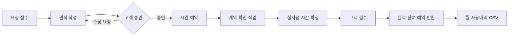

<div align="center">

# APPROID Desk

**고객 요청을 견적, 승인, 작업, 시간 정산, 완료까지 연결하는 운영 워크스페이스**

[](https://laravel.com)
[](https://www.php.net)
[](https://livewire.laravel.com)
[](https://www.mysql.com)
[](https://desk.approid.team)

[운영 서비스](https://desk.approid.team) · [구현 로드맵](docs/implementation-process.md) · [배포 가이드](docs/deployment.md)

</div>

---

APPROID Desk는 개발·유지보수 요청을 단순 티켓이 아닌 **계약과 시간이 연결된 업무 기록**으로 다룬다. 고객은 자신의 회사 자료만 보고 견적과 검수를 승인하며, 운영자는 작업 상태·실사용 시간·알림·장애 대응 이력을 하나의 흐름에서 관리한다.

## 핵심 흐름



180분 견적을 승인하고 150분을 사용한 기준 시나리오에서는 예약 180분, 순사용 150분, 반환 30분이 불변 원장으로 재현된다.

## 주요 기능

| 영역 | 제공 기능 |
| --- | --- |
| 고객사 분리 | 회사별 요청·견적·작업·시간 데이터 격리, 서버 Gate·Policy·쿼리 범위 이중 검사 |
| 요청과 견적 | 요청 접수, 담당자·상태 이력, 견적 버전, 고객 승인·수정 요청 |
| 계약 시간 | 제공·예약·실사용·반환·조정을 정수 분 단위의 불변 원장으로 관리 |
| 작업과 검수 | 작업기록 임시저장·확정, 차감·비차감 구분, 고객 검수, 취소·재작업 흐름 |
| 월 정산 | 계약별 월 현황, 사용내역·원장 CSV, 월 마감, 마감 후 조정 이력 |
| 알림 | DB·SMTP 큐 알림, 주간 보고, 중복 방지, 재시도·최종 실패 관리 |
| 주요 장애 | 1시간 내부 응답 목표, 대응·고객 협의·복구·롤백의 불변 이력 |
| 첨부 보안 | 비공개 저장, MIME·크기·개수 제한, SHA-256 무결성, ClamAV 검사, 권한 기반 다운로드 |
| 반응형 운영 UI | 역할별 대시보드, 데스크톱·태블릿·모바일, 라이트·다크 테마 |

> 첨부 보안 도메인과 다운로드는 구현되었으며, HTTP 업로드·목록·삭제 화면은 후속 범위다.

## 역할과 권한

| 역할 | 주요 권한 |
| --- | --- |
| 최고 관리자 | 전체 고객사·운영 설정·월 마감·조정·알림 재시도 |
| 운영자 | 고객사·프로젝트·요청·견적·작업·시간 운영 |
| 고객사 관리자 | 자사 견적 승인, 검수 완료, 월 사용내역, 자사 사용자 관리 |
| 고객사 일반 사용자 | 자사 요청·댓글·제출 견적 조회 |

일반 사용자는 견적을 볼 수 있지만 승인할 수 없고, 고객사 계정은 다른 회사의 URL을 직접 요청해도 접근할 수 없다.

## 기술 구성

```text
Browser
  └─ Laravel 13 + Livewire 4 + Blade + Flux UI + Tailwind CSS 4
       ├─ MySQL 8.4            계약·업무·불변 감사 데이터
       ├─ Database Queue      알림·악성 파일 검사
       ├─ Laravel Scheduler   월 전환·주간 보고·heartbeat
       ├─ Private Storage     권한 기반 첨부파일
       └─ ClamAV 1.4          스트리밍 악성 파일 검사

Production
  └─ Cloudflare Tunnel → 127.0.0.1:8080 → Nginx + PHP-FPM
```

PHP 8.4, Vite 8, PHPUnit 12, Laravel Pint, Larastan을 사용한다. 운영 앱·Queue·Scheduler는 하나의 관리된 이미지로 실행하고 MySQL·ClamAV·Tunnel은 별도 컨테이너로 분리한다.

## 빠른 시작

### 준비물

- Docker Engine 또는 Docker Desktop
- Docker Compose v2
- Git

로컬 PHP·Composer·MySQL은 필수가 아니다. 아래 명령은 Linux/WSL의 Bash를 기준으로 한다.

### 설치

```bash
git clone https://github.com/imorangepie20/approid-desk.git
cd approid-desk
cp .env.example .env

docker run --rm --user "$(id -u):$(id -g)" \
  -v "$PWD:/var/www/html" -w /var/www/html laravelsail/php84-composer:latest \
  composer install --ignore-platform-reqs --no-interaction

docker run --rm --user "$(id -u):$(id -g)" \
  -v "$PWD:/app" -w /app node:24-bookworm-slim \
  sh -lc 'npm ci && npm run build'

docker compose build
docker compose up -d --wait mysql clamav
docker compose run --rm laravel.test php artisan key:generate
docker compose run --rm laravel.test php artisan migrate
docker compose up -d
```

| 서비스 | 주소 |
| --- | --- |
| 앱 | <http://localhost:8000> |
| MySQL | `127.0.0.1:3307` |
| Vite | `127.0.0.1:5173` |

로컬 메일은 기본적으로 로그에 남고, Queue·Scheduler·ClamAV는 `docker compose up -d`에 함께 실행된다.

### 초기 관리자

```bash
docker compose exec laravel.test php artisan desk:create-initial-admin
```

계정이 하나도 없을 때만 실행된다. 일반 사용자는 공개 가입이 아닌 초대 흐름으로 등록한다.

## 개발 명령

```bash
# 상태와 로그
docker compose ps
docker compose logs -f laravel.test queue scheduler

# DB 마이그레이션
docker compose exec -T laravel.test php artisan migrate

# 코드 품질과 전체 회귀
docker compose exec -T laravel.test composer test
docker run --rm --user "$(id -u):$(id -g)" \
  -v "$PWD:/app" -w /app node:24-bookworm-slim npm run build

# 운영 프로세스 확인
docker compose exec -T laravel.test php artisan desk:check-scheduler
docker compose exec -T laravel.test php artisan schedule:list
docker compose exec -T clamav clamdscan --ping 5

# 종료
docker compose down
```

2026-10-04 기준 전체 회귀 **802개 테스트·5,085단언**, Pint **345파일**, PHPStan **242파일·오류 0건**, 프런트 빌드 **22모듈**을 통과했다. 동시성 검사는 독립 PHP 프로세스와 실제 MySQL 잠금을 사용하므로 전체 회귀에 시간이 걸릴 수 있다.

## 데모 시나리오

활성 시스템 계정이 하나인 개발 DB에서 다음 명령으로 전체 업무 흐름을 반복 실행할 수 있다.

```bash
docker compose exec -T laravel.test php artisan desk:create-customer-a-demo-request
docker compose exec -T laravel.test php artisan desk:submit-customer-a-demo-estimate
docker compose exec -T laravel.test php artisan desk:verify-customer-a-demo-user-approval-block
docker compose exec -T laravel.test php artisan desk:run-customer-a-demo all
```

시스템 계정이 둘 이상이면 `--actor=operator@example.com`으로 작업자를 명시한다. 데모 명령은 멱등적이지만 운영 환경에서는 실제 데이터와 알림을 만들므로 백업과 `--force`가 필요하다.

## 운영 배포

운영은 Zorin OS 홈서버의 Docker Compose와 Cloudflare Tunnel을 사용한다. 앱 포트는 `127.0.0.1:8080`에만 바인딩하고 MySQL·ClamAV는 외부에 공개하지 않는다.

```bash
./scripts/configure-production.sh
chmod 600 .env.production .env.database
./scripts/deploy-production.sh
```

실제 비밀값, SMTP 인증정보, Tunnel 토큰은 저장소에 넣지 않는다. 최초 설정·Mailcow 연동·토큰 회전·배포 후 검사는 [배포 가이드](docs/deployment.md)를 따른다.

## 문서

| 문서 | 내용 |
| --- | --- |
| [구현 순서](docs/implementation-process.md) | 0~4단계 로드맵, 완료 조건, 테스트·배포 검증 근거 |
| [배포 가이드](docs/deployment.md) | 홈서버, Docker, Cloudflare Tunnel, SMTP, 건강 검사 |
| [알림 카탈로그](docs/notification-catalog.md) | 업무 사건, 수신자, 중요도, 채널, 재시도·보안 규칙 |
| [UI 적용 기준](docs/admin-template-mapping.md) | 역할별 탐색, 반응형 화면, 시각 토큰, Chromium 검증 |
| [Hindsight 설정](docs/hindsight-setup.md) | 프로젝트 전용 공유 메모리, 인증 격리, 백업·복구 |

## 현재 상태

- 기능 로드맵 **0단계~4.35** 완료
- 고객사 A 전체 데모와 고객사 B 접근 차단 운영 검증 완료
- `https://desk.approid.team` 운영 배포, TLS·SMTP·Queue·Scheduler·ClamAV 기본 동작 확인
- 재부팅 복구, 클라우드 증분 백업, 별도 복원, 배포 롤백, 운영 인수 감사는 **4.36~4.43**의 남은 범위

완료 표시는 코드 존재가 아니라 자동 테스트, 수동 확인, 관련 문서 근거까지 충족했음을 의미한다.
